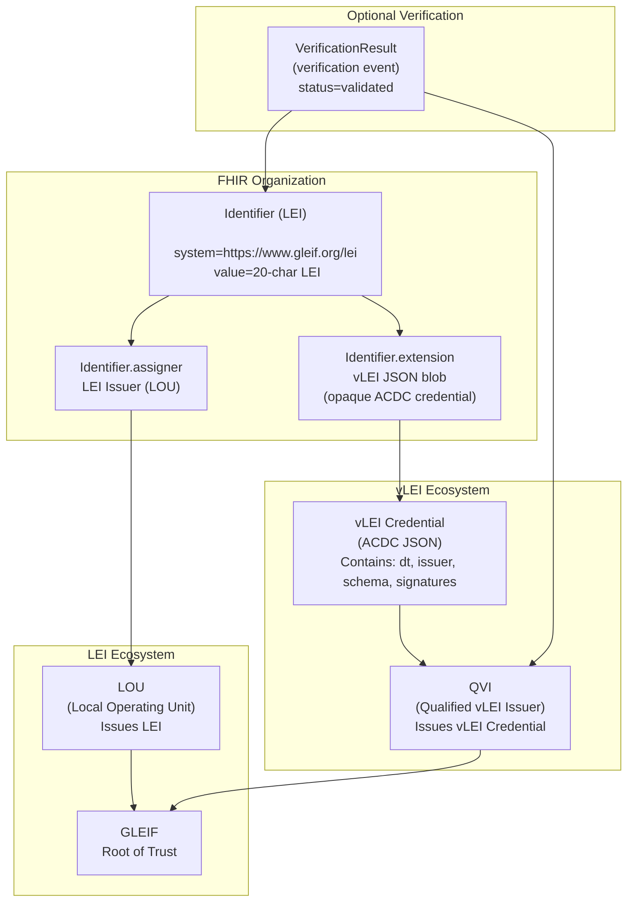
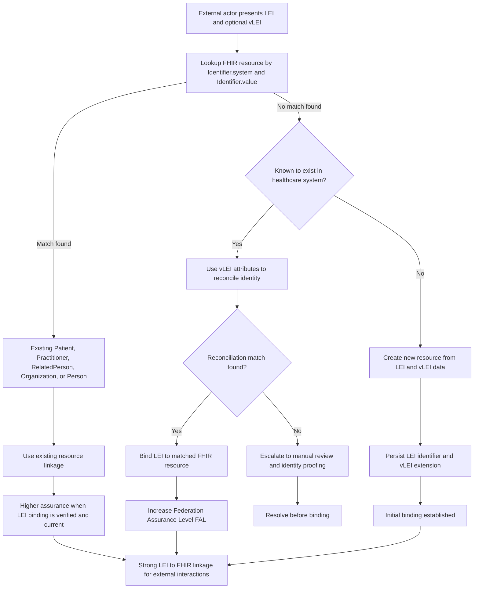

When a person or organization interacts with healthcare, the identity needs to be highly assured, and uniquely identified. This section describes how the Legal Entity Identifier (LEI) and verifiable LEI (vLEI) can be used to provide a strong identity for individuals and organizations in healthcare transactions, and how this identity can be represented in FHIR resources. The LEI and vLEI provide a standardized way to identify legal entities that engage in transactions, and can be used to ensure that the right information is returned to the right user, and that actions taken by users can be traced back to the correct entity for auditing and accountability purposes.

### Legal Entity Identity (LEI)

The [Legal Entity Identifier (LEI)](https://www.gleif.org/en/about-lei/what-is-lei) is a unique identifier for legal entities that engage in transactions. It is a 20-character alphanumeric code that is based on the [ISO 17442](https://www.iso.org/standard/59782.html) standard. The LEI is issued by authorized issuers, known as **Local Operating Units (LOUs)**, and is maintained by the **Global Legal Entity Identifier Foundation (GLEIF)**. The LEI can be used in healthcare transactions to identify the organization or individual that is providing care or services or receiving care services. The LEI can also be used for auditing and accountability, to ensure that actions taken by organizations can be traced back to the correct entity.

[vLEIs](https://www.gleif.org/en/organizational-identity/become-a-vlei-issuer-qvi/vlei-ecosystem-governance-framework) are verifiable credentials that are based on the LEI and can be used to provide additional information about the legal entity, such as its organizational structure, ownership, and other relevant information. The vLEI is issued by **Qualified vLEI Issuers (QVIs)**, which are authorized by GLEIF to issue vLEI credentials. The vLEI can be used in healthcare transactions to provide additional information about the organization or individual that is providing care or services or receiving care services. The vLEI can also be used for auditing and accountability, to ensure that actions taken by organizations can be traced back to the correct entity and that the information about the entity is accurate and up-to-date.

These identities will map into FHIR as either

- [Person](StructureDefinition-PersonLei.html) in a Person.identifier
- [Practitioner](StructureDefinition-PractitionerLei.html) in a Practitioner.identifier
- [RelatedPerson](StructureDefinition-RelatedPersonLei.html) in a RelatedPerson.identifier
- [Patient](StructureDefinition-PatientLei.html) in a Patient.identifier
- [Organization](StructureDefinition-OrganizationLei.html) in a Organization.identifier

The resource used will depend on the use case, and the LEI can appear in multiple more than one place. The Person resource is used to represent an individual who may have multiple roles in the healthcare system, such as a patient who is also a caregiver. The Practitioner resource is used to represent a worker such as a healthcare professional who provides care or services to patients. All of these resources can include identifiers, demographics, and other relevant information to support identity management in healthcare transactions.

The vLEI and/or LEI SHALL be encoded in an Identifier datatype as follows:

- Identifier.value = LEI
- Identifier.system = "https://www.gleif.org/lei"
- Identifier.assigner = may be the LOU, not the QVI
- Identifier.extension[lei] = the vLEI

Profiles:
- [Profile of Identifier to hold LEI and vLEI](StructureDefinition-lei.html)
- [Extension to carry the vLEI inside an Identifier](StructureDefinition-vlei.html)
- [Profile Person with an LEI Identifier](StructureDefinition-PersonLei.html)
- [Example Person with an LEI and vLEI](Person-example-person-lei.html)

### The role of the LEI

The above explains how to store a LEI, and thus how to find a FHIR entity resource that corresponds to a given LEI. The next step is to determine which FHIR resource(s) to use for a given LEI. This will depend on the use case, and the role of the entity in the healthcare system. For example, if the LEI corresponds to a healthcare organization, then it would be appropriate to use the Organization resource. If the LEI corresponds to an individual who is a patient, then it would be appropriate to use the Patient resource. If the LEI corresponds to an individual who is a healthcare professional, then it would be appropriate to use the Practitioner resource. If the LEI corresponds to an individual who has multiple roles, such as a patient who is also a caregiver, then it may be appropriate to use the Person resource. The key is to ensure that the LEI is consistently used across the healthcare system to identify the same entity, regardless of the role they may have in different contexts. This will help to ensure that the right information is returned to the right user, and that actions taken by users can be traced back to the correct entity for auditing and accountability purposes.

### Binding strength of LEI to FHIR resource

The LEI and vLEI provide a strong linkage between the identifier in the LEI and the person or entity. 

The FHIR resource provides the linkage to the healthcare data and is correlated to a person or entity with reference linkages to one of the resources mentioned above. The Patient resource and all of their medical data are recorded in the healthcare space as part of the Medical Record. The Organization and Practitioner resources are managed by the healthcare system and are used to record the identity of the organization and practitioners that provide care or services to patients. The Person resource is used to represent an individual who may have multiple roles in the healthcare system, such as a patient who is also a caregiver. **The assumption is that within the healthcare system, there is internal management of the entities present.**

Where the LEI linkage to healthcare becomes important is when interactions outside of the healthcare practice setting occur:

- When a patient is interacting from the internet or mobile device.
- When a practitioner is interacting from outside the healthcare organization, such as from a home office or mobile device.
- When other organizations are interacting with the healthcare system, such as payers, public health agencies, or other entities that need to exchange information with the healthcare system.

A special case is when the patient is first interacting with a healthcare system, where there is no existing data. In this case the Patient resource that is created would be created given the LEI and vLEI information. Similarly, this could occur with a Practitioner or RelatedPerson.

So the linkage between the LEI and the FHIR resource must be as strong as possible. This linkage process is described in NIST 800-63-4 as [**Federation Assurance Level (FAL)**](https://pages.nist.gov/800-63-4/sp800-63.html#federation-assurance-level). The FAL describes the level of assurance that can be provided when linking an identifier from an external system (such as the LEI) to a FHIR resource in the healthcare system. The FAL ranges from 1 to 3, with 3 being the highest level of assurance. The FAL is determined by the strength of the linkage between the external identifier and the FHIR resource, as well as the security controls in place to protect the data.

An example of this is when a Patient presents with a LEI, but lookup of a Patient by identifier of that LEI does not return a match. This could be because that healthcare record has not yet bound the patient's LEI to their Patient resource. If they know that the Patient has data in the healthcare system, then they can use the elements found in the vLEI to attempt to match the patient to an existing Patient resource. If they are able to find a match, then they can link the LEI to that Patient resource, and thus achieve a higher FAL. 

