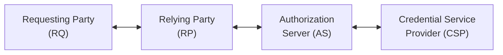

This section provides a high level overview of identity workflows outlined in this IG. 

Golden Identity and User Identity are the two main categories of identity management covered in this IG. The Golden Identity focuses on the unique and consistent identifier for a data subject (such as a patient or client) across different healthcare systems and organizations, while the User Identity focuses on the identity management for clinical users, patients as users, and other authorized agents such as relatives or caregivers.

Human and Organization Actors:

- **Patient**: The individual seeking healthcare services or accessing their own medical records.
- **Credential Service Provider** (**CSP**): The entity responsible for verifying the patient's identity and issuing a Golden Identifier.
- **Healthcare System**: The organization providing healthcare services and managing patient interactions, including the use of Golden and User Identities for accurate record matching and access.
- **Practitioner**: The healthcare professional providing care to the patient and accessing their medical records for clinical decision-making. Practitioners include clinical, billing, administrative, and other healthcare users.

Technical Actors:

- **Credential Service Provider** (**CSP**): The entity responsible for verifying the patient's identity and issuing a Golden Identifier. The CSP may use various authentication methods, such as biometric verification, to ensure the accuracy of the identity verification process.
- **Authorization Server** (**AS**): The system responsible for making authorization decisions based on the User Identity tokens provided by the CSP. The Authorization Server may use role-based access control (RBAC) or attribute-based access control (ABAC) to determine the appropriate level of access for each user. The Authorization Server may also provide Consent enforcement (see FAST Consent Management)
- **Relying Party** (**RP**): The healthcare system or application that relies on the User Identity tokens provided by the CSP for authentication and authorization. The RP may use the tokens to grant access to specific resources or perform actions on behalf of the user.
- **Requesting Party** (**RQ**): The entity requesting access to a patient's medical records or other healthcare resources. The RQ is a system that may be used by a practitioner, patient, or other authorized agent. .
- **Match Client**: The system responsible for requesting a match given some demographics information.
- **Match Service**: The system responsible for performing the matching of patient records based on the provided demographics information. The Match Service may use probabilistic matching algorithms to determine the likelihood of a match and return the results to the Match Client.

**The Prime interactions**

The following are illustrative of the prime interactions between the Technical Actors in the identity workflows:

The RQ is accessing the RP, the RP redirects (OAuth) to the AS, the AS redirects to the CSP for authentication, the CSP returns a token to the AS, the AS returns a token to the RP, and the RP returns a token to the RQ. The RQ then uses the token to access resources on behalf of the patient.

The Match Client does not have a Golden Identifier, so uses Match Service to find the Patient's Golden Identifier.

### Patient presents with a Golden Identity

When a patient presents with a Golden Identity, the healthcare system can use this identifier to accurately find the patient across different systems and organizations. The Golden Identity allows for seamless access to the patient's medical records, ensuring that the correct information is retrieved and used for clinical decision-making. The Golden Identity includes current and accurate demographics and other attributes. The Golden Identity has been identity assurance proofed.

This workflow the Patient is not a user (see next use-case), but is the subject of healthcare workflows such as treatment, payment, or other healthcare services. The Golden Identity is used to find the patient in the healthcare system, and the healthcare system may use the Golden Identity to retrieve the patient's medical records, update their information, or perform other actions related to their care.

The Golden Identifier is used to link all of the patient's medical records across different healthcare systems and organizations, ensuring that the patient's medical history is accurately maintained and accessible. The healthcare system may also use the Golden Identity to facilitate communication and coordination of care among different providers involved in the patient's treatment. The Golden Identity is also used to support patient privacy consent, patient preferences, and other patient-centered workflows that require accurate identification of the patient.

#### Patient presents as a User

When a patient presents as a User, they may be accessing their own medical records or interacting with the healthcare system through a patient portal or other digital platform. In this case, the User Identity is derived off of the Golden Identifier. The CSP authenticates the User Identity, providing User Identity tokens (i.e., OpenId-Connect) to support authorization workflows at the healthcare system. The User Identity token includes current and accurate demographics and other attributes. The User Identity has been identity assurance proofed, and authenticated to the level of assurance required by the healthcare system.

The Patient is a user of the healthcare system, and the User Identity is used to access their own medical records, update their information, or perform other actions related to their care. For example: setup appointments, request prescription refills, update Consent provisions, review lab results, and communicate with their healthcare providers.

### Patient presents without a Golden Identity

There are two scenarios when a patient presents without a Golden Identity depending on the urgency of the situation. Ultimately the Patient will need to obtain a Golden Identity to ensure accurate matching and access to their medical records in the future, but the immediate healthcare need will be accomplished with the available demographic information.

#### Patient is not able to get a Golden Identifier at this time

Such as when the patient is not healthy in an urgent or emergent setting.

When a patient presents without a Golden Identity, the healthcare system must rely on other demographic information to match the patient. This may include name, date of birth, address, and other identifying information. The system may use probabilistic matching algorithms to determine the likelihood of a match based on the available information. In cases where a match cannot be confidently established, the system may prompt for additional information or verification from the patient or their authorized representative.

The Match Client can ask for only certain matches, or only the best ONE match be returned, or all matches.

#### Patient is asked to get a Golden Identifier

In this case the Patient has not been issued a Golden Identifier, so is assisted with obtaining one. The verification process is handled by the Credential Service Provider (CSP) which is outside the scope of this IG. The CSP will verify the patient's identity and issue a Golden Identifier, which can then be used for future interactions with the healthcare system.

The CSP will interact with the Data custodians to align the new Golden Identifier with the existing patient records, ensuring that the patient's medical history is accurately linked to their new identifier. This process may involve matching demographic information, such as name, date of birth, and address, to ensure that the correct records are associated with the new Golden Identifier.

CSP -> Match Service -> Data Custodian

### Resource Locator

Match Client may have a Golden Identifier or may only have demographics information. The Match Client wants to know where (i.e. Organizations) the patient has records. The Match Client will use the Golden Identifier or demographics information to request a list of organizations where the patient has records. The Match Service will return a list of organizations where the patient has records, along with any relevant metadata about the records, such as the type of record, date of service, and other relevant information.

TODO: This is a new feature not previously supported by the IDI-Match Operation.

### Maintenance of Golden Identifier

over time Patients change their demographics, such as name, address, and phone number. The healthcare system must ensure that the Golden Identifier associated details are updated to reflect these changes, so that the patient's medical records remain accurate and accessible. The CSP may provide a process for patients to update their demographics information, which will then be used to update the Golden Identifier in the healthcare system. Relying Parties may also have a process for updating the Golden Identifier associated details, which will then be used to update the Golden Identifier in the healthcare system. The healthcare system may also have a process for verifying and validating the updated information to ensure that it is accurate and complete.

A specific example is when two Golden Identifiers are found to be associated with the same patient. The healthcare system must have a process for merging the two Golden Identifiers into a single identifier, ensuring that all of the patient's medical records are accurately linked to the correct identifier. This may involve verifying the patient's identity and demographics information, as well as reviewing the medical records associated with each identifier to ensure that they are accurate and complete. This process might not be automated due to the sensitive nature of changing medical records and identities that had previously been used as high assurance identities. 

