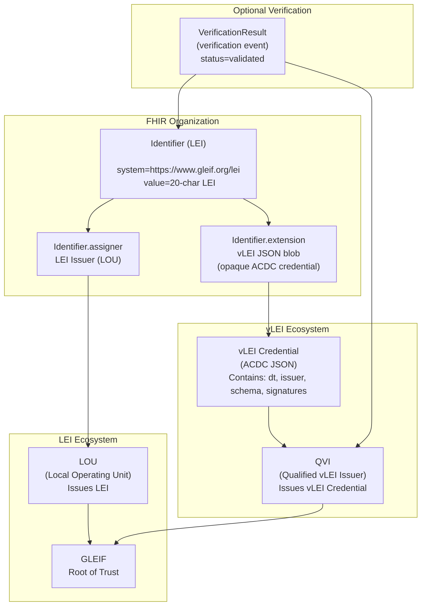

When a user interacts with healthcare the identity needs to be highly assured, and uniquely identified. This IG includes services used to identify a user. The use case for a user include clinical users, patients as users, and other authorized agents such as relatives or caregivers. The user identity is important for authentication and authorization, and to ensure that the right information is returned to the right user. The user identity is also important for auditing and accountability, to ensure that actions taken by users can be traced back to the correct individual or organization.

[vLEIs](https://www.gleif.org/en/organizational-identity/become-a-vlei-issuer-qvi/vlei-ecosystem-governance-framework) are a type of identifier that can be used to uniquely identify legal entities, such as healthcare organizations. vLEIs are issued by authorized issuers and are based on the ISO 17442 standard. vLEIs can be used in healthcare transactions to identify the organization that is providing care or services, and to ensure that the correct information is returned to the correct organization. vLEIs can also be used for auditing and accountability, to ensure that actions taken by organizations can be traced back to the correct entity.

These identities will map into FHIR as either

- [Person](StructureDefinition-PersonLei.html) in a Person.identifier
- [Practitioner](StructureDefinition-PractitionerLei.html) in a Practitioner.identifier
- [RelatedPerson](StructureDefinition-RelatedPersonLei.html) in a RelatedPerson.identifier
- [Patient](StructureDefinition-PatientLei.html) in a Patient.identifier
- [Organization](StructureDefinition-OrganizationLei.html) in a Organization.identifier

The resource used will depend on the use case, and the LEI can appear in multiple more than one place. The Person resource is used to represent an individual who may have multiple roles in the healthcare system, such as a patient who is also a caregiver. The Practitioner resource is used to represent a worker such as a healthcare professional who provides care or services to patients. All of these resources can include identifiers, demographics, and other relevant information to support identity management in healthcare transactions.

The vLEI and/or LEI SHALL be encoded in an Identifier datatype as follows:

- Identifier.value = LEI
- Identifier.system = "https://www.gleif.org/lei"
- Identifier.assigner = may be the LOU, not the QVI
- Identifier.extension[lei] = the vLEI

Profiles:
- [Profile of Identifier to hold LEI and vLEI](StructureDefinition-lei.html)
- [Extension to carry the vLEI inside an Identifier](StructureDefinition-vlei.html)
- [Profile Person with an LEI Identifier](StructureDefinition-PersonLei.html)
- [Example Person with an LEI and vLEI](Person-example-person-lei.html)

